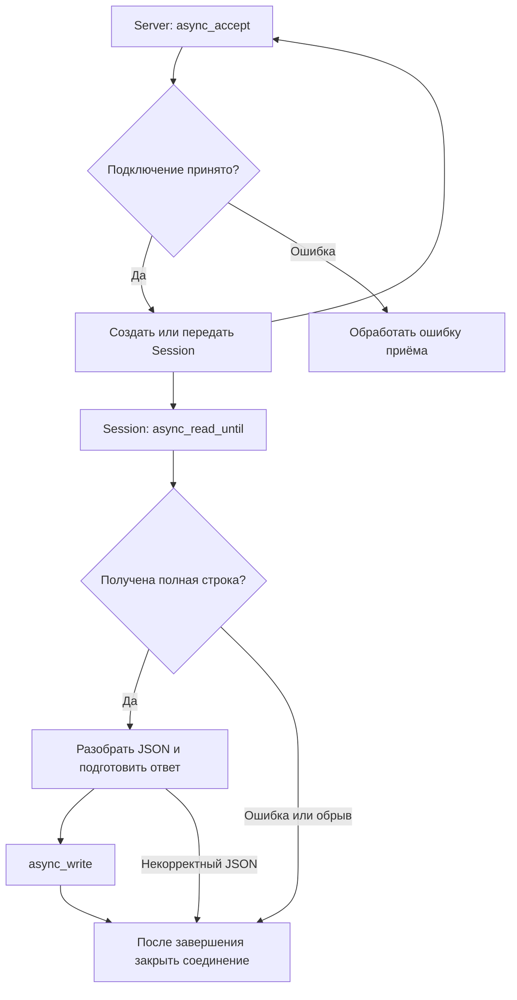

# Асинхронный TCP-сервер: теория и план переделки

Цель: сервер должен обслуживать несколько подключённых клиентов так, чтобы ожидание данных от одного клиента не мешало остальным.

План рассчитан на текущие `daytimeServer.cpp`, `daytimeClient.cpp`, `Parser` и `Serializer`. Первая версия: один поток, Boost.Asio, обработчики завершения, один запрос и один ответ на соединение. Клиент пока может оставаться синхронным.

## 1. Что происходит сейчас

В `daytimeServer.cpp` внутри бесконечного цикла выполняются следующие действия:

1. `acceptor.accept(socket)` ждёт подключения.
2. `socket.read_some(...)` ждёт данные клиента.
3. `Parser::parse(...)` разбирает JSON.
4. `boost::asio::write(...)` отправляет ответ.
5. При выходе из тела цикла локальный сокет уничтожается, соединение закрывается.
6. Сервер возвращается к приёму следующего клиента.

Если первый клиент подключится и ничего не отправит, сервер останется на чтении. Другие подключения могут попасть в очередь операционной системы, а клиентский `connect` даже может завершиться успешно. Но код сервера ещё не начнёт их обслуживать.

**Проблема находится в ожидании внутри единственной последовательности действий.** Замена только `accept` на `async_accept` не решит её, если чтение и запись останутся блокирующими.

## 2. Асинхронность понятным языком

### Синхронная операция

Ты вызываешь функцию и получаешь управление обратно после её завершения. Для текущих блокирующих сетевых вызовов это может означать длительное ожидание.

Пример: «Жди письмо от клиента А и ничего дальше не делай, пока оно не придёт».

### Асинхронная операция

Ты запускаешь операцию и передаёшь функцию, которую нужно вызвать после её завершения. Такой обработчик называют **callback** или **completion handler**. Результат операции, в том числе ошибка, приходит в обработчик.

Пример: «Когда придёт письмо от А, вызови эту функцию. Пока письма нет, можно обслуживать Б».

В модели с callback вызов `async_read_until` запускает ожидание. Он не означает, что JSON уже получен и его можно сразу разбирать. Разбор должен находиться в обработчике успешного чтения.

### Асинхронность и несколько потоков

Для первой версии достаточно одного потока. Пока сетевые операции ожидают данные, сервер может принимать новые соединения и выполнять готовые обработчики других клиентов.

При одном потоке обработчики выполняются по очереди. Одновременно могут ожидать завершения многие операции, но два участка твоего C++-кода не выполняются параллельно. Поэтому долгий расчёт или `sleep` внутри обработчика задержит всех клиентов.

Несколько потоков — отдельный следующий шаг, когда понадобится параллельно выполнять обработчики. Сейчас он усложнит работу с общими данными.

## 3. Основные части Boost.Asio

| Часть | Для чего нужна |
| --- | --- |
| `io_context` | Обеспечивает работу асинхронных операций и выполнение их обработчиков |
| `io_context.run()` | Запускает обработку событий в вызывающем потоке |
| `tcp::acceptor` | Принимает новые TCP-подключения |
| `tcp::socket` | Представляет соединение с одним клиентом |
| Буфер | Хранит получаемые или отправляемые байты |
| Обработчик | Продолжает работу после завершения конкретной операции |

В `main` сначала нужно создать сервер и запустить первое асинхронное ожидание подключения, затем вызвать `io_context.run()`.

`run()` сам может ждать событий, но это ожидание обслуживает все зарегистрированные операции. Он возвращается, когда больше нет работы либо контекст остановлен. Наличие одного лишь объекта `acceptor` не удерживает цикл событий: нужна ожидающая операция. В этой схеме постоянно перевыставляется `async_accept`, поэтому отдельный `work_guard` на старте не требуется. Подробнее: [io_context::run](https://www.boost.org/latest/doc/html/boost_asio/reference/io_context/run.html).

## 4. У каждого клиента должно быть своё состояние

Сейчас сокет, массив `arr`, запрос и ответ — локальные переменные одной итерации. В асинхронном коде функция, запустившая операцию, завершится раньше самой операции.

Удобно выделить два класса:

| Класс | Ответственность | Примерные поля |
| --- | --- | --- |
| `Server` | Принимать подключения и запускать сессии | `acceptor_`, доступ к `io_context` |
| `Session` | Провести обмен с одним клиентом | `socket_`, `requestBuffer_`, `responseText_` |

**Сессия — объект, который хранит всё необходимое для обслуживания одного соединения.** У клиента А свой объект `Session`, у клиента Б — другой. Их буферы не смешиваются.

`Server` не должен ожидать окончания сессии: после приёма подключения он запускает её чтение и снова начинает ожидать следующее подключение. Подобное разделение показано в [учебном асинхронном daytime-сервере Boost.Asio](https://www.boost.org/latest/doc/html/boost_asio/tutorial/tutdaytime3.html).

### Время жизни сессии

Объект `Session` должен существовать, пока обработчики обращаются к его полям. Типичный подход — `std::shared_ptr<Session>` и наследование от `std::enable_shared_from_this<Session>`.

Перед запуском операции метод получает `auto self = shared_from_this()`, а лямбда захватывает `self` **по значению**. Копия указателя удерживает сессию до завершения обработчика. Если обработчик запускает следующую операцию, её обработчик тоже удерживает сессию.

Важные правила:

- Создать объект под управлением `shared_ptr` до вызова `start()`.
- Не вызывать `shared_from_this()` из конструктора.
- Захват одного `this` не продлевает жизнь объекта.
- Не создавать новый независимый `shared_ptr` из `this`: это может привести к повторному удалению.
- После последнего обработчика сессия уничтожится, если других владельцев нет.

Такой приём есть в [официальном примере async TCP echo для C++11](https://live.boost.org/doc/libs/1_88_0/doc/html/boost_asio/example/cpp11/echo/async_tcp_echo_server.cpp).

Для `Server` на первом этапе достаточно времени жизни до окончания `run()`: создать его в `main` перед этим вызовом.

### Время жизни буферов

`boost::asio::buffer(...)` описывает участок памяти, а не создаёт независимую копию содержимого. Поэтому отправляемую строку нужно хранить в `responseText_` и не менять до окончания записи. Локальная строка внутри метода запуска может исчезнуть слишком рано.

Буфер чтения тоже принадлежит сессии и существует до завершения операции. Пока чтение выполняется, не нужно самостоятельно очищать или менять этот буфер. Подробнее: [буферы Boost.Asio](https://www.boost.org/latest/doc/html/boost_asio/reference/buffer.html).

## 5. TCP передаёт поток байтов, а не отдельные JSON

Один вызов отправки не соответствует одному вызову чтения. Например, отправлено:

```json
{"message":"Привет"}
```

Сервер может сначала получить `{"mes`, затем остальную часть. Несколько отправок также могут объединиться в одном чтении. Размер массива 100 байт не задаёт границу сообщения.

Поэтому прежде, чем вызывать `Parser::parse`, нужно понять: **сообщение уже получено целиком или пока пришёл только фрагмент?** Это правило требуется и синхронному, и асинхронному серверу.

### Предлагаемый протокол: один JSON на строку

Для текущего проекта удобно договориться:

1. Сериализовать объект в компактный JSON без форматирования на несколько строк.
2. После готового JSON добавить один настоящий байт перевода строки `\n`.
3. Получатель читает до этого разделителя.
4. Извлекает одну строку и передаёт JSON в `Parser`.

Обозначение передаваемого сообщения:

```text
{"message":"Привет"}<LF>
```

`<LF>` здесь означает байт перевода строки, а не буквальный текст. Перенос строки внутри значения `message` JSON-сериализатор экранирует как два символа `\n`; это не разделитель между сообщениями. Не следует отправлять pretty-printed JSON с настоящими переносами между полями.

На сервере подходит `async_read_until(socket_, requestBuffer_, '\n', handler)` с `boost::asio::streambuf`. При успехе число байт в обработчике включает разделитель. В буфере могут находиться и байты после него: извлекай ровно одну строку, а не разбирай весь буфер как один JSON. Нельзя запускать ещё одно чтение того же сокета, пока это чтение не завершилось. См. [async_read_until](https://www.boost.org/doc/libs/latest/doc/html/boost_asio/reference/async_read_until/overload1.html).

Для первой версии соединение заканчивается после одного ответа. Если позже появятся повторные запросы, остаток буфера нужно сохранить для следующего сообщения.

Ограничь входной буфер, например 64 КиБ, включая разделитель. Это выбранный учебный предел, его можно изменить. Клиент, который шлёт данные без `\n`, не должен бесконечно увеличивать расход памяти.

### Что поменяется в клиенте

В `daytimeClient.cpp` нужно добавлять `\n` к запросу и читать ответ до `\n`, например синхронным `boost::asio::read_until`. Сервер тоже добавляет разделитель к ответу.

Если изменить только сервер, старый клиент отправит JSON без разделителя и будет ждать ответа, а сервер будет ждать конца строки. Оба останутся в ожидании.

`Serializer` может по-прежнему возвращать чистый JSON. Добавление сетевого разделителя удобно оставить в коде отправки клиента и сессии.

## 6. Последовательность работы новой версии



Две ветки после приёма означают независимое ожидание операций, а не обязательное выполнение в разных потоках.

Псевдокод ответственности методов:

```text
Server.start_accept:
    подготовить сессию с собственным сокетом
    запустить async_accept в её сокет
    после успешного приёма:
        запустить Session.start
        снова запустить ожидание подключения
    при ошибке:
        записать причину и решить, можно ли продолжать приём

Session.start:
    запустить чтение до конца строки

Session.on_read:
    при ошибке завершить эту сессию
    извлечь одну строку
    разобрать и проверить JSON
    сформировать ответ и сохранить его в поле сессии
    добавить разделитель
    запустить async_write

Session.on_write:
    проверить результат
    закрыть соединение
```

`boost::asio::async_write` при успешном завершении записывает весь переданный буфер, тогда как `async_write_some` может записать только часть. Успех записи не подтверждает, что приложение клиента уже разобрало ответ. Составная запись используется и в [примере Daytime.3](https://www.boost.org/latest/doc/html/boost_asio/tutorial/tutdaytime3.html).

## 7. Ошибки должны завершать конкретную сессию

В обработчиках чтения и записи проверяй `boost::system::error_code` до обработки результата.

| Ситуация | Поведение первой версии |
| --- | --- |
| Клиент отключился до конца строки | Закрыть сессию, неполный JSON не разбирать |
| Ошибка отправки | Записать причину и закрыть сессию |
| JSON повреждён | Записать ошибку формата и закрыть сессию |
| Нет поля `message` или оно не строка | Считать запрос некорректным и закрыть сессию |
| Превышен размер входного буфера | Завершить чтение и закрыть сессию |
| Приём отменён при остановке сервера | Не запускать его заново |

Текущий `Parser` может выбросить исключение при разборе, обращении к полю или преобразовании типа. Перехватывай его в обработчике запроса, чтобы ошибка одного клиента не вышла в общий цикл событий. Общий `try/catch` вокруг `main` этого разделения не обеспечивает.

Ошибки `accept` относятся ко всему серверу. Для временной ошибки можно повторить попытку; при устойчивой нехватке ресурсов нужна задержка или явное завершение с сообщением. Бесконечное немедленное повторение при любой ошибке может загрузить процессор.

В дальнейшем добавь таймер ожидания запроса и записи через `steady_timer`: асинхронность позволяет обслуживать других клиентов, но молчащие соединения всё равно занимают ресурсы. При завершении сессии отменяй таймер, а его обработчик должен учитывать отмену.

## 8. Пошаговый план изменения файлов

### Шаг 1. Исправить работу с границами сообщений

- [ ] Зафиксировать правило «компактный JSON + `\n`» для запроса и ответа.
- [ ] В клиенте и пока ещё синхронном сервере перейти на чтение до разделителя.
- [ ] Убрать связку `resize(s)` + `strcpy(...data(), arr)`.
- [ ] Проверить один обычный запрос и запрос длиннее 100 байт.

`strcpy` ищет завершающий нулевой байт, которого в полученных из TCP данных может не быть. Нулевое заполнение массива не спасает, если прочитаны все 100 байт. Для отдельного полученного фрагмента корректное представление — строка из ровно `s` байт, например `std::string(arr, s)`, но это само по себе ещё не собирает полный JSON.

**Результат шага:** приложение корректно выделяет сообщение независимо от того, какими порциями пришли байты.

### Шаг 2. Вынести работу с клиентом в Session

- [ ] Выделить сокет, входной буфер и строку ответа в поля сессии.
- [ ] Намечать методы `start`, чтение, обработку запроса, отправку и завершение.
- [ ] Разбирать JSON один раз: сейчас сервер вызывает `parse` дважды для одного запроса.
- [ ] Оставить формирование ответа «ОК + время» и существующий формат `message`.

**Результат шага:** вся информация одного клиента находится в одном объекте.

### Шаг 3. Перевести всю сетевую цепочку на async

- [ ] Выделить `Server` с `acceptor_` и `start_accept()`.
- [ ] Использовать `async_accept` и повторно запускать приём после успешного подключения.
- [ ] Запускать `async_read_until` в сессии.
- [ ] Формировать ответ только после успешного чтения полной строки.
- [ ] Отправлять через `async_write`; закрывать соединение после его завершения.
- [ ] Удерживать сессию в каждом обработчике через `shared_ptr`.
- [ ] В `main` заменить обслуживающий `for (;;)` запуском сервера и `io_context.run()`.

**Результат шага:** приём новых клиентов продолжается, пока предыдущие ждут данные или отправку ответа.

### Шаг 4. Изолировать ошибки и ограничить ресурсы

- [ ] Обработать ошибки чтения, записи и приёма.
- [ ] Перехватывать ошибки разбора запроса внутри сессии.
- [ ] Установить предел входного буфера.
- [ ] Добавить в логи идентификатор сессии и этап операции.

**Результат шага:** отключение или плохой запрос одного клиента не прекращает обслуживание остальных.

### Шаг 5. Упорядочить файлы и сборку

Можно начать с классов в `daytimeServer.cpp`, затем вынести их в `Server.h/.cpp` и `Session.h/.cpp`. Новые `.cpp` нужно добавить к цели `server` в `CMakeLists.txt`.

В проектном описании указан C++11, но сейчас `CMakeLists.txt` задаёт C++20. Описанная архитектура использует возможности C++11: обычные лямбды, `shared_ptr`, `enable_shared_from_this`. Для C++11 пиши отдельный `auto self = shared_from_this();` и захват `[self]`: захват `[self = shared_from_this()]` требует C++14. Корутины для этой модификации не нужны.

Не меняй стандарт сборки автоматически: совместимость установленной версии Boost с C++11 нужно проверить отдельно. Текущая запись через изменяемый `std::string::data()` также не подходит для C++11.

## 9. Как проверить результат

Собирать проект можно в отдельном каталоге:

```bash
cmake -S . -B build-async
cmake --build build-async
```

Запусти `./build-async/server`, а клиенты — в других терминалах командой `./build-async/client 127.0.0.1`.

| Проверка | Ожидаемый результат |
| --- | --- |
| Обычный запрос | Клиент получает корректный JSON-ответ |
| Клиент А подключён и стоит на вводе, клиент Б отправляет сообщение | Б получает ответ до того, как А что-либо отправит |
| Несколько клиентов отправляют разные сообщения | Каждый получает ответ в своём соединении; логи позволяют различить сессии |
| JSON длиннее 100 байт, но меньше лимита | Запрос обрабатывается целиком |
| JSON отправлен двумя частями с паузой, `\n` только в конце | Ответ появляется после второй части; другие клиенты работают во время паузы |
| Некорректный JSON или `{"message":42}` с разделителем | Закрывается только соответствующее соединение |
| Клиент отключается до окончания запроса | Сервер продолжает принимать клиентов |
| Данные без разделителя достигают предела буфера | Соединение завершается, память не растёт без ограничения |
| Много последовательных подключений | Завершённые сессии освобождаются |

Для отправки неполных или некорректных запросов понадобится небольшой отдельный тестовый клиент либо TCP-инструмент. Обычный клиент всегда сериализует корректный объект. Для проверки фрагментации важно сделать две отправки с паузой, а не надеяться на случайное разделение пакетов.

**Главная проверка асинхронности:** молчащий клиент А не задерживает ответ клиенту Б. Обычный успешный обмен с одним клиентом этого не доказывает.

## 10. Что изучать после первой рабочей версии

1. **Тайм-ауты и предел числа соединений.** Освобождать ресурсы слишком медленных клиентов.
2. **Несколько запросов на одном соединении.** После отправки ответа запускать следующее чтение, сохраняя остаток входного буфера.
3. **Очередь исходящих сообщений.** Если ответы создаются независимо, хранить очередь и начинать следующую запись после предыдущей.
4. **Тяжёлая обработка.** Выносить длительные вычисления из потока сетевых обработчиков.
5. **Несколько потоков `run()` и `strand`.** Изучить последовательное выполнение обработчиков одной сессии и защиту общих данных перед добавлением потоков.

Поддержка многих соединений не означает неограниченное число клиентов: остаются ограничения памяти, сокетов и времени обработки.

## 11. Вопросы для самопроверки

- Почему одного `async_accept` недостаточно?
- Где должна находиться обработка JSON после запуска асинхронного чтения?
- Кто удерживает `Session`, когда метод `start()` уже завершился?
- Почему локальная строка ответа может исчезнуть слишком рано?
- Как отличить часть JSON от полного сообщения?
- Почему клиент должен тоже учитывать новый разделитель?
- Что произойдёт со всеми клиентами, если обработчик будет считать что-то пять секунд?
- Почему два открытых клиентских окна ещё не доказывают, что сервер асинхронный?

Начни с шага 1: надёжные границы сообщений дадут понятную основу для последующего перехода на обработчики.
